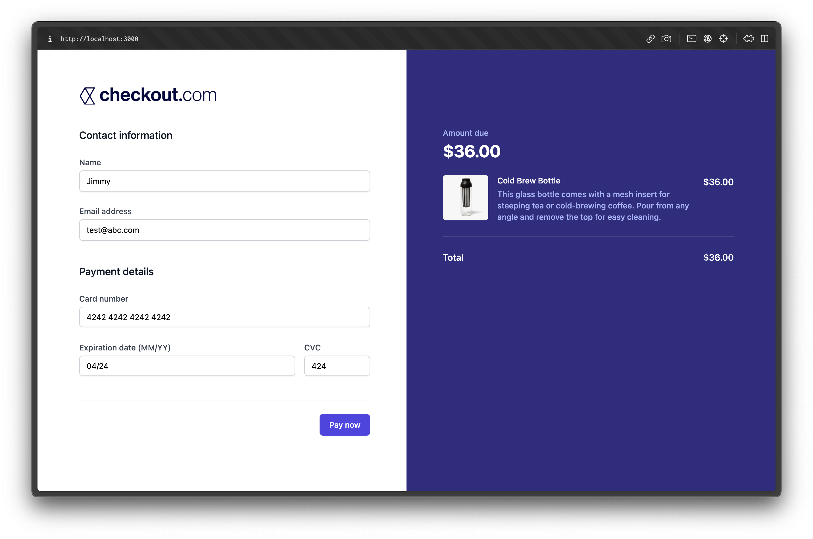
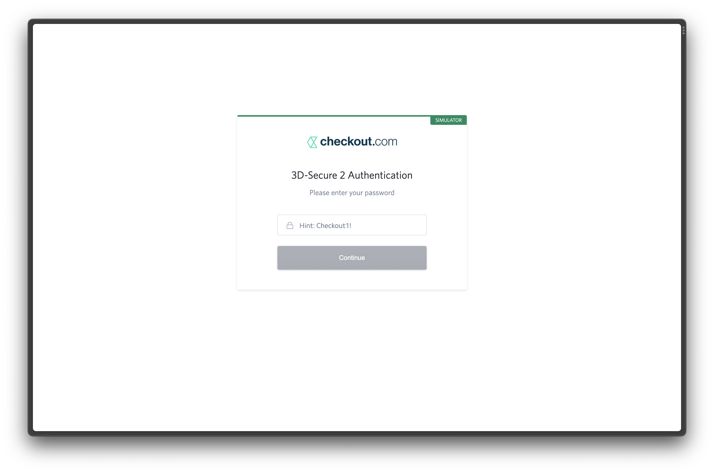
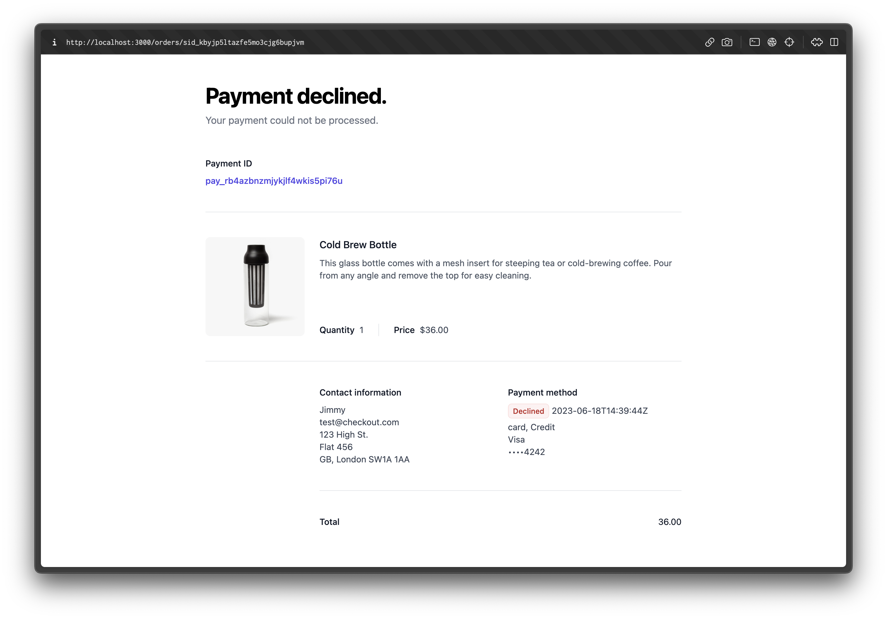
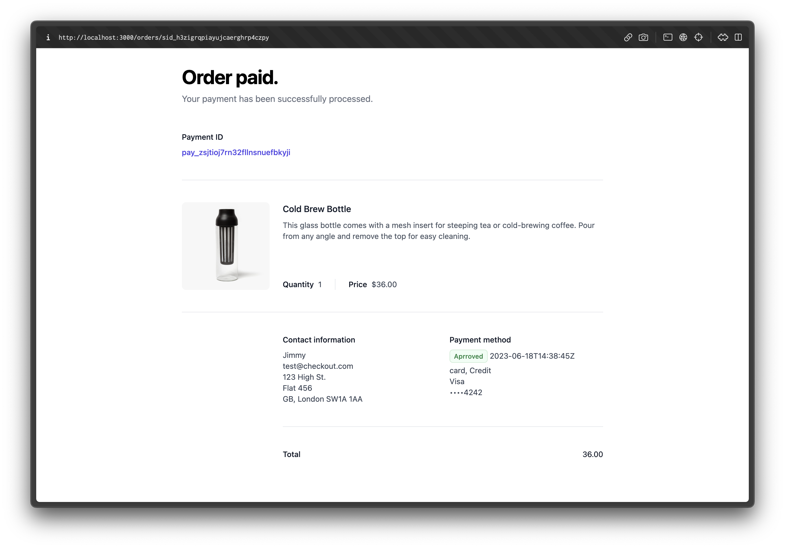

# Accept a payment on Checkout.com

## Purpose

This project demonstrates how to accept payment on Checkout.com with next.js.

This example created a checkout page with a hardcoded breakdown of the product/transaction details, customer name and email input fields, and Checkout.Frames integration for accepting card details. Upon clicking the pay button, the payment form should be submitted, and the token generated by Checkout.Frames should be sent to the API mentioned in Requirement 2, which will return a 3DS redirection URL. After completing the verification with the password "Checkout1!", the user will be redirected to a success/fail page based on the verification outcome. The candidate will be required to create the checkout, success, and fail pages.

## Getting Started

To proceed with this test, please [create a test account](https://www.checkout.com/get-test-account) on Checkout.com. Once you have created the account, you can generate a public and secret key to use for this project.

### Add Enviroment Variables

Update the `.env` file with the public and secret keys generated earlier. The `.env` file should have the following variables:

```env
NEXT_PUBLIC_CHECKOUT_COM_PUBLIC_KEY=<public_key>
CHECKOUT_COM_SECRET_KEY=<secret_key>
DEV_BASE_URL=<dev_base_url>
PROD_BASE_URL=<prod_base_url>
```

### Quick Start

```bash
git@github.com:jimmyclchu/checkout-com-test.git
cd checkout-com-test
npm install
npm run dev
```

Open [http://localhost:3000](http://localhost:3000) with your browser to see the result.

## Demo

* [Live Demo](https://checkout-com-test.vercel.app)

The demo is running in test mode -- use 4242424242424242 as a test card number with any CVC + future expiration date.

Use the 100 test CVV to trigger a 3D Secure challenge flow.

Read more about [test card numbers](https://www.checkout.com/docs/developer-resources/testing/test-cards) on Checkout.com.

### Checkout View



### 3D Secure View



### Failure View



### Success View

